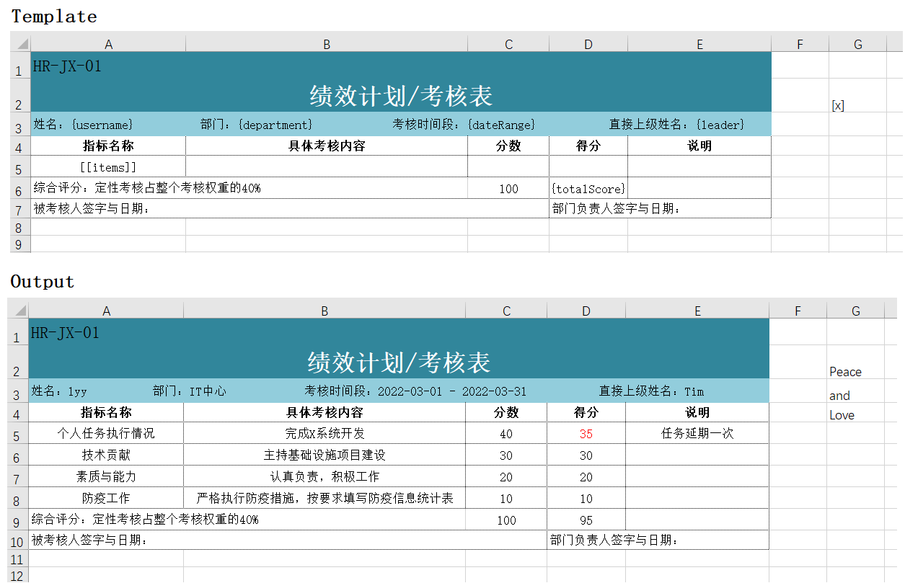

# PHP Excel Template

从模板生成Excel文件，支持多变量的渲染，自定义渲染行为，设置回调函数。

## 演示



代码如下:
```
use Kaxiluo\PhpExcelTemplate\CellVars\CallbackContext;
use Kaxiluo\PhpExcelTemplate\CellVars\CellArray2DVar;
use Kaxiluo\PhpExcelTemplate\CellVars\CellArrayVar;
use Kaxiluo\PhpExcelTemplate\CellVars\RenderDirection;
use Kaxiluo\PhpExcelTemplate\PhpExcelTemplate;

$data = [
    ['个人任务执行情况', '完成X系统开发', '40', '35', '任务延期一次'],
    ['技术贡献', '主持基础设施项目建设', '30', '30', ''],
    ['素质与能力', '认真负责，积极工作', '20', '20', ''],
    ['防疫工作', '严格执行防疫措施，按要求填写防疫信息统计表', '10', '10', ''],
];
$items = new CellArray2DVar(
    $data,
    true,
    false,
    function (CallbackContext $context) use ($data) {
        if ($context->getLoopColKey() === 3) {
            if ($context->getValue() < $data[$context->getLoopRowKey()][2]) {
                $context->getStyle()->getFont()->getColor()->setARGB('FFFF0000');
            }
        }
    }
);
$vars = [
    'username' => 'lyy',
    'department' => 'IT中心',
    'dateRange' => '2022-03-01 - 2022-03-31',
    'leader' => 'Tim',
    'items' => $items,
    'totalScore' => '=SUM(D5:D' . (4 + count($data)) . ')',
    'x' => new CellArrayVar(['Peace', 'and', 'Love'], RenderDirection::DOWN, false),
];

PhpExcelTemplate::save('./example-kpi.xlsx', './example-kpi-output.xlsx', $vars);
```

## 安装

[Packagist](https://packagist.org/packages/kaxiluo/php-excel-template)
```bash
composer require kaxiluo/php-excel-template
```

## 功能

- 字符串变量渲染
- 一维数组变量渲染，自定义渲染方向（向下的行或向右的列）、是否插入新的行或列
- 二维数组变量渲染，自定义向下是否插入新的行、向右是否插入新的列
- 设置回调函数，定制渲染样式或其他特殊行为

### 模板变量说明

在模板中声明变量名只允许特定字符(字母数字-_.)，任何变量的值不会被二次渲染。

#### 字符串变量（CellStringVar）
1）在模板中使用`{yourStringVarName}`声明字符串变量

2）如何定义变量值如下：
```
use Kaxiluo\PhpExcelTemplate\CellVars\CellStringVar;
use Kaxiluo\PhpExcelTemplate\CellVars\CallbackContext;
use Kaxiluo\PhpExcelTemplate\PhpExcelTemplate;

$vars = [
    // 默认
    'var1' => 'value1', 
    'var2' => new CellStringVar('value2'),
    // 设置回调
    'var1' => new CellStringVar('i was red color', function (CallbackContext $context) {
        $context->getStyle()->getFont()->getColor()->setARGB('FFFF0000');
    }),
];

PhpExcelTemplate::save('/path/to/templateFile.xlsx', '/path/to/outputFile.xlsx', $vars);
```

#### 一维数组变量（CellArrayVar）
1）在模板中使用`[yourArrayVarName]`声明一维数组变量

2）如何定义变量值如下：
```
use Kaxiluo\PhpExcelTemplate\CellVars\CellArrayVar;
use Kaxiluo\PhpExcelTemplate\CellVars\CallbackContext;
use Kaxiluo\PhpExcelTemplate\CellVars\RenderDirection;
use Kaxiluo\PhpExcelTemplate\PhpExcelTemplate;

$vars = [
    // 默认向下渲染，插入新的行
    'var1' => ['x1', 'x2'],
    'var2' => new CellArrayVar(['x', 'x']),
    'var3' => new CellArrayVar(['x', 'x'], RenderDirection::DOWN, true),
    // 向右渲染，插入新的列
    'var3' => new CellArrayVar(['x', 'x'], RenderDirection::RIGHT),
    // 向右渲染，不插入新的列
    'var4' => new CellArrayVar(['x', 'x'], RenderDirection::RIGHT, false),
    // 向下渲染，不插入新的行
    'var5' => new CellArrayVar(['x', 'x'], RenderDirection::DOWN, false),
    // 设置回调
    'var6' => new CellArrayVar(
        ['x6-1', 'x6-2', 'x6-3'],
        RenderDirection::RIGHT,
        true,
        function (CallbackContext $context) {
            // $context->getWorksheet()
            // $context->getValue()
            // 设置第二条数据(x6-2)加粗
            if ($context->getLoopColKey() === 1) {
                $context->getStyle()->getFont()->setBold(true);
            }
        }
    ),
];

PhpExcelTemplate::save('/path/to/templateFile.xlsx', '/path/to/outputFile.xlsx', $vars);
```

#### 二维数组变量（CellArray2DVar）
1）在模板中使用`[[yourArray2DVarName]]`声明二位数组变量

2）如何定义变量值如下：
```
use Kaxiluo\PhpExcelTemplate\CellVars\CellArray2DVar;
use Kaxiluo\PhpExcelTemplate\CellVars\CallbackContext;
use Kaxiluo\PhpExcelTemplate\PhpExcelTemplate;

$vars = [
    // 默认向右-下方渲染，下方插入新的行，右边不插入新的列
    'var1' => [['a1', 'b1'], ['a2', 'b2']],
    'var2' => new CellArray2DVar([['c1', 'd1'], ['c2', 'd2']]),
    'var3' => new CellArray2DVar([['a5', 'b5'], ['a6', 'b6']], true, false),
    // 插入新的行和列
    'var4' => new CellArray2DVar([['a5', 'b5'], ['a6', 'b6']], true, true),
    // 不插入新的行和列
    'var5' => new CellArray2DVar([['a5', 'b5'], ['a6', 'b6']], false, false),
    // 不插入新的行，插入新的列
    'var6' => new CellArray2DVar([['a5', 'b5'], ['a6', 'b6']], false, true),
    // 设置回调
    'var7' => new CellArray2DVar(
        [['x', '88'], ['y', '59'], ['z', '95']],
        true,
        false,
        function (CallbackContext $context) {
            // 第二列小于60则字体标红
            if ($context->getLoopColKey() === 1 && $context->getValue() < 60) {
                $context->getStyle()->getFont()->getColor()->setARGB('FFFF0000');
            }
        }
    ),
];

PhpExcelTemplate::save('/path/to/templateFile.xlsx', '/path/to/outputFile.xlsx', $vars);
```

## 其他
目前已处理了同一个行上的变量同时设置插入新的行，不会插入额外的行，列同理。用户需要考虑多个变量均为插入新行或列，其产生的相互影响。
